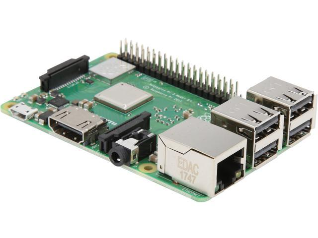

--------------------------------------------------------------------------------

# Motivación

La motivación que hay detrás de este trabajo es la de estudiar cómo funcionan los productos de almacenamiento en la nube, a través de la creación de un servidor bastante básico de almacenamiento en red sobre nuestro propio servidor. 

Para ello hemos usado una *Raspberry Pi 3* en la que hemos instalado el programa de software libre *Nextcloud*. Sobre este servidor muy básico hemos tenido que realizar ciertas labores de administración, más propias de una asignatura como *Ingeniería de Servidores*, y otras labores centradas en aspectos de redes. 

Esto nos ha permitido conocer y aprender hasta cierto punto los aspectos a tener en cuenta para crear infraestructuras de este tipo, centrándonos especialmente en aspectos específicos de las redes.

--------------------------------------------------------------------------------

# Especificación del hardware usado

El hardware que hemos usado es el siguiente:

* Raspberry Pi 3 Model B:
    * CPU Quad Core 1,2GHz Broadcom BCM2837 64bit
    * 1GB RAM
    * Tarjeta SD *Samsumg Evo*, 64 GB (actúa como disco duro del ordenador)
* Cargador de móvil *MicroUSB*: dará corriente a la *Raspberry Pi 3*

---

--------------------------------------------------------------------------------

# Instalación básica del servidor

## Instalación del sistema operativo

* Ubuntu Server: sin interfaz gráfica para ahorrar recursos
* Descargamos el `.img` del siguiente [link](https://ubuntu.com/download/iot/raspberry-pi)

---

* Vemos dónde está localizada la tarjeta SD con `lsblk`
* Quemamos la imagen con el comando: `sudo dd if="ubuntu-raspberry.img" of="/dev/sdb" bs=4M status=progress`
    * `if`: archivo de entrada
    * `of`: archivo de salida
    * `bs`: tamaño del bloque
    * `status=progress`: para ver la barra de progreso
* Se podría usar una herramienta con `GUI` como `etcher`

---

## Configuración inicial del sistema

### Montaje de la Raspberry Pi

* Insertamos la tarjeta SD en la *Raspberry Pi*
* Conectamos el cable ethernet RJ45 entre el router de nuestra casa y la *Raspberry Pi*
* Conectamos un cargador de móvil *micro-usb* a la toma de la *Raspberry Pi*

---

### Primera conexión

* Gracias a que estamos usando *Ubuntu Server*, tenemos `ssh` habilitado por defecto
* Abrimos el administrador del router en nuestro navegador (`192.168.1.1`) para localizar la ip local de la raspberry
* Hacemos ssh: `ssh ubuntu@192.168.1.8`

---

---

* El usuario `ubuntu` está en la lista de `sudoers`
* El usuario `root` no tiene contraseña. Solo se puede alcanzar:
    1. Accediendo a `ubuntu`
    2. `sudo su -`
* Lo primero que vamos a hacer es actualizar el sistema:
    * `sudo apt update;  sudo apt upgrade`
    * Instalamos paquetes básicos como `vim` o `make` para empezar a trabajar

---

## Creación del usuario de administración

* Desde `root`
* Crearemos un usuario `administrator` para las labores de administración del servidor
* Ejecutamos `useradd -m administrator`:
    * `-m`: crea el directorio `home` según lo indicado por el directorio `/etc/skel`
* Añadimos el administrador al grupo `sudo`: `usermod -aG sudo administrator`
    * `-a`: en vez de cambiar el grupo, añadimos un grupo suplementario
    * `-G`: opción obligatoria tras `-G` que indica los grupos suplementarios
* Cambiamos la contraseña de este usuario con `passwd administrator`
* Borramos el usuario `ubuntu`: `userdel -r ubuntu`:
    * `-r`: para borrar los ficheros del usuario
* Editamos `/etc/passwd` para que la shell de `administrator` sea bash

---

### Cuidado!

* Antes de borrar al usuario `ubuntu` hay que comprobar que tenemos permisos para hacer `sudo` y para logearnos en el `root`
* En otro caso nos quedaríamos sin todos los permisos de administración

# Aspectos de Redes en la instalación del servidor

## Protección básica del servidor

* Hasta ahora nuestro servidor solo es alcanzable desde la red local. 
* Queremos conectarlo al exterior de nuestra red, pero antes debemos dar una seguridad básica
* Inseguridades más evidentes:
    * Al hacer `ssh` nos conectamos a través de una contraseña $\rightarrow$ ataques por fuerza bruta
    * Estos ataques se pueden dirigir directamente al usuario `root` lo que lo hace más peligroso
        * En verdad ahora no se puede porque no tiene contraseña, pero si le diésemos contraseña se abriría esta posibilidad
* Hay infinidad de problemas que no estamos contemplando (ataques `DDoS`, por ejemplo), pero en esta sección solo nos vamos a preocupar de estos

---

### Generamos claves asimétricas

* `ssh` puede usar claves de cifrado asimétrico, que son las que vamos a usar para hacer el log
* Desde nuestro ordenador, creamos nuestras claves con: `ssh-keygen`
    * Genera claves asimétricas que, por defecto, usan RSA
    * Se puede usar un `passphrase`
        * Nos protege si nos roban la clave privada
* El comando genera los archivos:
    * `~/.ssh/id_rsa`: clave privada
    * `~/.ssh/id_rsa.pub`: clave pública

---

### Colocamos las claves asimétricas en el servidor

* Copiamos la clave pública al servidor con: `scp id_rsa.pub administrator@192.168.1.8:~/.ssh/sergio.pub`
* Dentro del servidor añadimos la clave: `cat ~/.ssh/sergio.pub >> ~/.ssh/authorized_keys` 
* Ya no se nos pedirá una contraseña cuando nos conectemos a `administrator`
* Aún así, seguimos pudiendo conectarnos a través de contraseña, y por tanto, no hemos asegurado nada todavía

---

### Pequeña aseguración

* Editaremos el archivo `/etc/ssh/sshd_config`
    * Para que no se puedan usar contraseñas: `PasswordAuthentification: no`
    * Para que no se pueda acceder al `root` desde `ssh`: `PermitRootLogin: no`

---

## Configuración para el acceso remoto

El primer obstáculo para que nuestro servidor sea accesible desde el exterior es que no sabemos cuál es la ip de nuestro servidor. Además, aunque la sepamos, lo cual es bastante fácil con un comando como `curl ifconfig.me`, por usar un proveedor de internet para redes de hogar, en nuestro caso *Vodafone*, la ip no es estática, es decir, que va cambiando con el tiempo. Por tanto, la solución es usar un servidor `dns` al que le estemos comunicando constantemente nuestra dirección ip. Usaremos una solución gratuita a través de la página [duckdns.org](duckdns.org)

--------------------------------------------------------------------------------

# Instalación de Nextcloud

# Uso básico de Nextcloud

# Análisis del sistema

# Referencias
