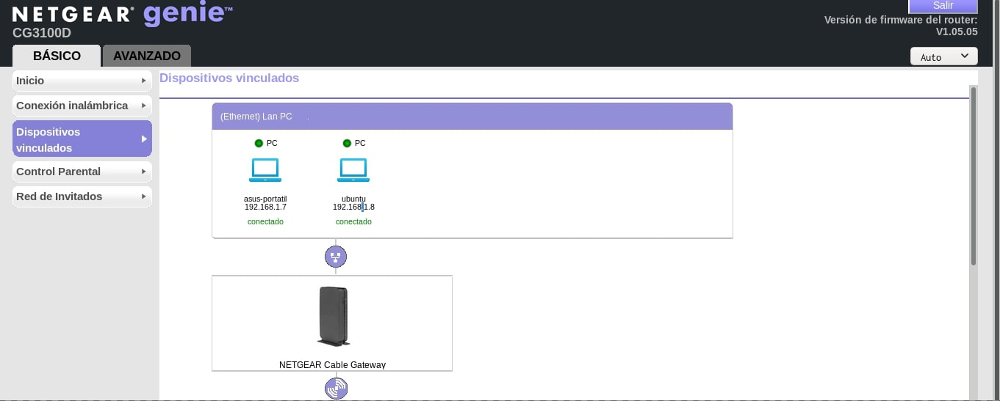
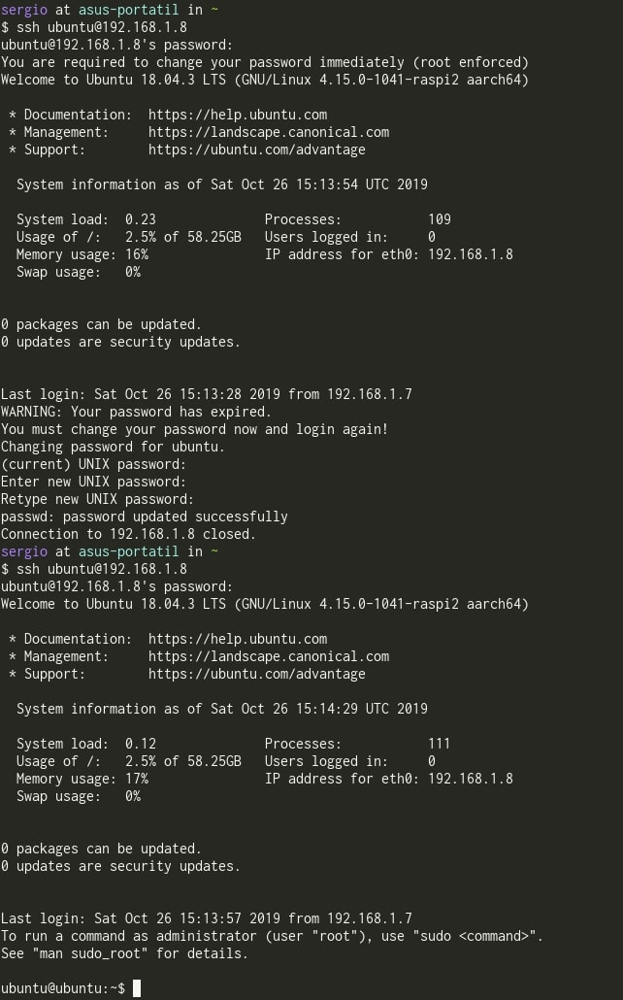
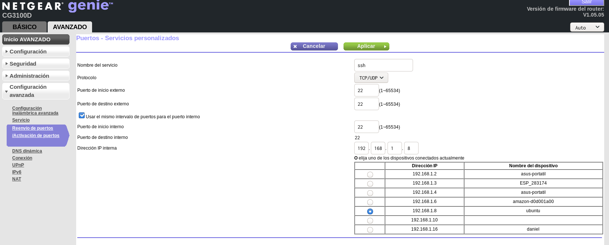

--------------------------------------------------------------------------------

# Motivación

* Podríamos haber orientado el trabajo hacia la teoría
* Hemos decido hacer un trabajo orientado a clonar algún servicio de almacenamiento web

--------------------------------------------------------------------------------

# NextCloud

--------------------------------------------------------------------------------

# Especificación del hardware usado

El hardware que hemos usado es el siguiente:

* Raspberry Pi 3 Model B:
    * CPU Quad Core 1,2GHz Broadcom BCM2837 64bit
    * 1GB RAM
    * Tarjeta SD *Samsumg Evo*, 64 GB (actúa como disco duro del ordenador)
* Cargador de móvil *MicroUSB*: dará corriente a la *Raspberry Pi 3*

---

--------------------------------------------------------------------------------

# Instalación básica del servidor

## Instalación del sistema operativo

* Ubuntu Server: sin interfaz gráfica para ahorrar recursos
* Descargamos el `.img` del siguiente [link](https://ubuntu.com/download/iot/raspberry-pi)

---

* Vemos dónde está localizada la tarjeta SD con `lsblk`
* Quemamos la imagen con el comando: `sudo dd if="ubuntu-raspberry.img" of="/dev/sdb" bs=4M status=progress`
    * `if`: archivo de entrada
    * `of`: archivo de salida
    * `bs`: tamaño del bloque
    * `status=progress`: para ver la barra de progreso
* Se podría usar una herramienta con `GUI` como `etcher`

---

## Configuración inicial del sistema

### Montaje de la Raspberry Pi

* Insertamos la tarjeta SD en la *Raspberry Pi*
* Conectamos el cable ethernet RJ45 entre el router de nuestra casa y la *Raspberry Pi*
* Conectamos un cargador de móvil *micro-usb* a la toma de la *Raspberry Pi*

---

### Primera conexión

* Gracias a que estamos usando *Ubuntu Server*, tenemos `ssh` habilitado por defecto
* Abrimos el administrador del router en nuestro navegador (`192.168.1.1`) para localizar la ip local de la raspberry
* Hacemos ssh: `ssh ubuntu@192.168.1.8`

---

---

* El usuario `ubuntu` está en la lista de `sudoers`
* El usuario `root` no tiene contraseña. Solo se puede alcanzar:
    1. Accediendo a `ubuntu`
    2. `sudo su -`
* Lo primero que vamos a hacer es actualizar el sistema:
    * `sudo apt update;  sudo apt upgrade`
    * Instalamos paquetes básicos como `vim` o `make` para empezar a trabajar

---

## Creación del usuario de administración

* Desde `root`
* Crearemos un usuario `administrator` para las labores de administración del servidor
* Ejecutamos `useradd -m administrator`:
    * `-m`: crea el directorio `home` según lo indicado por el directorio `/etc/skel`
* Añadimos el administrador al grupo `sudo`: `usermod -aG sudo administrator`
    * `-a`: en vez de cambiar el grupo, añadimos un grupo suplementario
    * `-G`: opción obligatoria tras `-G` que indica los grupos suplementarios
* Cambiamos la contraseña de este usuario con `passwd administrator`
* Borramos el usuario `ubuntu`: `userdel -r ubuntu`:
    * `-r`: para borrar los ficheros del usuario
* Editamos `/etc/passwd` para que la shell de `administrator` sea bash

---

---

### Cuidado!

* Antes de borrar al usuario `ubuntu` hay que comprobar que tenemos permisos para hacer `sudo` y para logearnos en el `root`
* En otro caso nos quedaríamos sin todos los permisos de administración

# Aspectos de Redes en la instalación del servidor

## Protección básica del servidor

* Hasta ahora nuestro servidor solo es alcanzable desde la red local. 
* Queremos conectarlo al exterior de nuestra red, pero antes debemos dar una seguridad básica
* Inseguridades más evidentes:
    * Al hacer `ssh` nos conectamos a través de una contraseña $\rightarrow$ ataques por fuerza bruta
    * Estos ataques se pueden dirigir directamente al usuario `root` lo que lo hace más peligroso
        * En verdad ahora no se puede porque no tiene contraseña, pero si le diésemos contraseña se abriría esta posibilidad
* Hay infinidad de problemas que no estamos contemplando (ataques `DDoS`, por ejemplo), pero en esta sección solo nos vamos a preocupar de estos

---

### Generamos claves asimétricas

* `ssh` puede usar claves de cifrado asimétrico, que son las que vamos a usar para hacer el log
* Desde nuestro ordenador, creamos nuestras claves con: `ssh-keygen`
    * Genera claves asimétricas que, por defecto, usan RSA
    * Se puede usar un `passphrase`
        * Nos protege si nos roban la clave privada
* El comando genera los archivos:
    * `~/.ssh/id_rsa`: clave privada
    * `~/.ssh/id_rsa.pub`: clave pública

---

### Colocamos las claves asimétricas en el servidor

* Copiamos la clave pública al servidor con: `scp id_rsa.pub administrator@192.168.1.8:~/.ssh/sergio.pub`
* Dentro del servidor añadimos la clave: `cat ~/.ssh/sergio.pub >> ~/.ssh/authorized_keys` 
* Ya no se nos pedirá una contraseña cuando nos conectemos a `administrator`
* Aún así, seguimos pudiendo conectarnos a través de contraseña, y por tanto, no hemos asegurado nada todavía

---

### Pequeña aseguración

* Editaremos el archivo `/etc/ssh/sshd_config`
    * Para que no se puedan usar contraseñas: `PasswordAuthentification: no`
    * Para que no se pueda acceder al `root` desde `ssh`: `PermitRootLogin: no`

---

## Configuración para el acceso remoto

* Nuestro primer obstáculo para que el servidor sea accesible desde el exterior es que no sabemos cuál es la `IP` del servidor:
    * `curl ifconfig.me`: nos dice la `IP`
    * Tenemos un servicio de internet con *Vodafone* que no nos da `IP` estática. La `IP` va cambiando a lo largo del tiempo
* **Solución**: conectarnos con un servidor de `DNS` cada cierto tiempo para comunicarle nuestra `IP`

---

### DuckDNS

* Usamos la página gratuita [duckdns](duckdns.org)
* Lo primero es registrarnos, en nuestro caso, con una cuenta de `Google`
* Registramos un nuevo registro, por ejemplo, `danielsergio.duckdns.org`
* Seguimos los pasos que nos indica la página:
    * Comprobamos que el servicio de `cron` está corriendo 
    * Creamos el archivo `~/duckdns/duck.sh` con el comando siguiente:

~~~bash
echo url="https://www.duckdns.org/update?domains=
danielsergio&token=valor_token&ip=" 
curl -k -o ~/duckdns/duck.log -K -
~~~

* El comando envía un mensaje `HTTP` de `UPDATE`, comunicandole nuestro `token` para que actualice la `IP` asociada al dominio `danielsergio.duckdns.org`
* Ahora, configurando `cron` hacemos que se ejecute este script cada cinco minutos:
    * `crontab -e`
    * `*/5 * * * * ~/duckdns/duck.sh >/dev/null 2>&1`

---

* Lo siguiente que necesitamos hacer es el reenvío de puertos para que se pueda acceder por `ssh` y se pueda acceder a las páginas web que mostremos:
    * Puerto 22: `ssh`
    * Puerto 80: `http`
    * Puerto 443: `https`
* Abrimos el administrador de nuestro router desde el `192.168.1.1`

---

--------------------------------------------------------------------------------

# Instalación y configuración de Nextcloud

## Instalación

* Usamos `snap` como gestor de paquetes porque su versión de `nextcloud` viene con algunas facilidades
* Para instalar `nextcloud`: `sudo snap install nextcloud`
* Comprobamos la instalación con `snap changes nextcloud`
* Con esto hemos instalado el *Stack* `LAMP`:
    * `Linux`
    * `Apache`
    * `MariaDB`: versión alternativa de software libre de `MySQL`
    * `PHP`

---

*  Creamos un usuario y contraseña de administrador propio para Nextcloud: `sudo nextcloud.manual-install dbadmin <password>`
* Con `sudo nextcloud.occ config:system:get trusted_domains` vemos que el único dominio por el que podemos acceder al servidor apache de Nextcloud es `localhost`
* Añadimos nuestro dominio en los dominios de confianza con `nextcloud.occ config:system:set trusted_domains 1 -[value=midominio.com](http://value=midominio.com/)`
* Accedemos a [danielsergio.duckdns.org](http://danielsergio.duckdns.org) y como ya hemos creado por la línea de comando una cuenta de administrador, accedemos con ella a `NextCloud`

---

## Certificado HTTPS

* Muchos de los plugins que podemos instalar en `nextcloud` exigen que tengamos el certificado de `HTTPS`, como por ejemplo el gestor de contraseñas
* Para ello vamos a certificar nuestro servidor
* Hay dos formas:
    * Manual: Usando el certificador que queramos, por ejemplo [Cerbot](https://certbot.eff.org)
    * Usando el certificador que trae `nextcloud`: nos quita de muchas complicaciones

---

* Antes de pasar el certificador, hacemos una mínica configuración del firewall con *Uncomplicated Firewall* o `ufw`:
    * `sudo ufw allow 80,443/tcp`
* Ahora pasamos el certificador con: `sudo nextcloud.enable-https lets-encrypt`

---

* Es importante que antes de realizar la certificación hayamos hecho el reenvío de puertos al puerto 443, porque a partir de ahora `nextcloud` solo usará `HTTPS`
* Si no lo hacemos, no tendremos acceso a la página hasta hacer el reenvío de puertos

# Referencias:

* [1]: [Guía extensa sobre instalación de NextCloud](https://www.digitalocean.com/community/tutorials/how-to-install-and-configure-nextcloud-on-ubuntu-16-04)
* [2]: [Página de Cerbot](https://certbot.eff.org/lets-encrypt/ubuntuother-apache)
